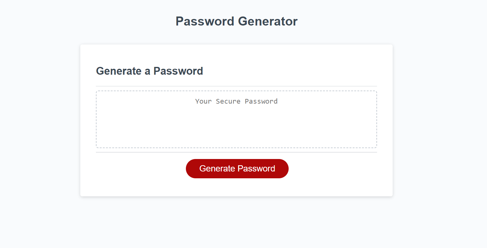
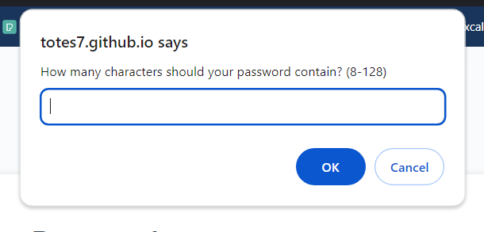
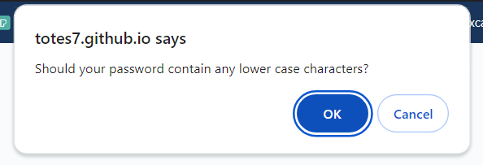

# Password-Generator

A JavaScript password generator is a dynamic and interactive tool designed to create strong and secure passwords for users. Utilizing the programming capabilities of JavaScript, this generator can generate random combinations of characters, including uppercase and lowercase letters, numbers, and special symbols. Users can often customize the password length and select specific criteria to meet their security requirements. The generator ensures the creation of unique and robust passwords, enhancing the overall security of online accounts and systems. Through a user-friendly interface, individuals can effortlessly generate complex passwords, contributing to better protection against unauthorized access and potential security threats.

## Project Results

## Deployment

* The site was deployed to GitHub Pages. The steps required are as follows:
    * From the GitHub main repository, navigate to Settings page.
    * Locate the Pages section.
    * Here, select Main Branch from the drop-down menu.
    * Once selected, GitHub will generate a link to the complete website.

## Technologies Used

### Languages Used

* [HTML5](https://en.wikipedia.org/wiki/HTML5)
* [JavaScript](https://en.wikipedia.org/wiki/JavaScript)
* [Markdown](https://en.wikipedia.org/wiki/Markdown)

## License

N/A
